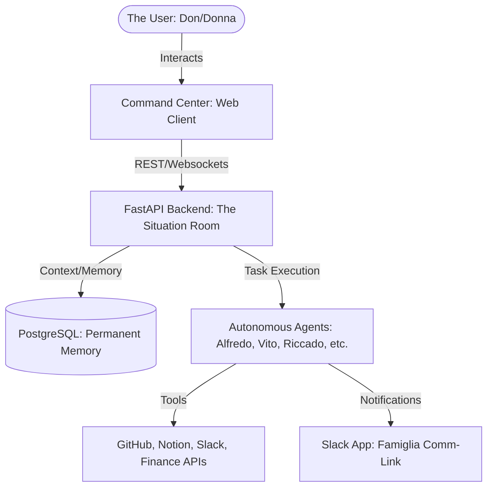

# **“Famiglia Core”** - The Engine of the AI Famiglia


`Famiglia Core` is the foundational multi-agent framework that powers the entire **“La Passione”** ecosystem. It provides the shared intelligence, tooling, and memory management required to build and scale autonomous agents.

---

## 🚀 Quick Start

Get the Famiglia up and running in under 5 minutes using Docker.

```bash
# 1. Pull the official image
docker pull ghcr.io/ai-passione/famiglia-core:latest

# 2. Run the Command Center & Backend
docker run -d \
  --name famiglia-core \
  -p 8000:8000 \
  -p 5173:5173 \
  --env-file .env \
  ghcr.io/ai-passione/famiglia-core:latest
```

> [!TIP]
> Ensure you have your `.env` file configured with required API keys. See [env.example](env.example) for the list of required secrets.

---

## 🏛 The Trinity Architecture

The Famiglia operates on "The Trinity," an integrated ecosystem designed for total business autonomy.



---

## 💎 Core Capabilities

*   **⚡️ LangGraph Integration**: State-of-the-art agent orchestration using directed acyclic graphs.
*   **🧠 Permanent Memory**: Long-term context storage using PostgreSQL and vector memories.
*   **🛠 Tool Mastery**: Native support for Slack, GitHub, Notion, and general web research tools.
*   **🎭 Sovereign Identity**: Each agent has a unique "Soul" and personality (Alfredo, Vito, Riccado).
*   **💅 Aesthetics First**: A premium "Italian Noir" dashboard for real-time monitoring.

---

## 🤝 Contributing

We welcome additions to the Family, provided they follow our [Code of Conduct](CODE_OF_CONDUCT.md). Please see our [CONTRIBUTING.md](CONTRIBUTING.md) for details on how to pitch your visions and submit PRs.

---

## ⚖️ License

Built with ❤️ by **AI Passione.**

This project is licensed under the **Apache License 2.0**. See the [LICENSE](LICENSE) file for the full text.
