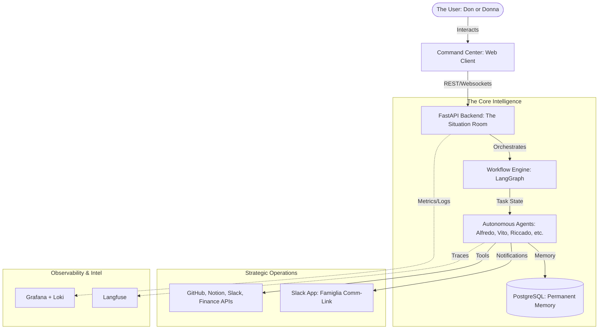

# **“Famiglia Core”** - The Engine of the AI Famiglia


`Famiglia Core` is the foundational multi-agent framework that powers the entire **“La Passione”** ecosystem. It provides the shared intelligence, tooling, and memory management required to build and scale autonomous agents.

---

## 🚀 Quick Start

Get the Famiglia up and running in under 5 minutes using Docker.

```bash
# 1. Pull the official image
docker pull ghcr.io/ai-passione/famiglia-core:latest

# 2. Run the Command Center & Backend
docker run -d \
  --name famiglia-core \
  -p 8000:8000 \
  -p 5173:5173 \
  --env-file .env \
  ghcr.io/ai-passione/famiglia-core:latest
```

> [!TIP]
> Ensure you have your `.env` file configured with required API keys. See [env.example](env.example) for the list of required secrets.

---

# **Core Features**

## 1. Multi-Agents in one place

- What is better than having an AI assistant? Having a family of AI agents working for you!
- Each agent has its own personality, skills, and tools - Just like a real family.
- See [**Detailed Agent Roster**](docs/agent_roster_la_famiglia.md) for full profiles, skills, and soul definitions.

## 2. 24/7 Operations
- **Runtime:** Agents run 24/7, monitoring Slack continuously.
- **Coordination:** Hybrid model - Direct assignment (@mentions) + Auto-response to triggers + Alfredo coordination when unclear.
- **Personality:** Professional during work week, more casual Friday evenings and weekends.
- **Autonomy:** Phase 1 (cautious) for first 4-8 weeks → Phase 2 (autonomous) after trust established.
- **Scheduled Tasks:** Commend & Conquer! Assign scheduled tasks and re-occuring tasks to your AI family.  See [**Scheduled Tasks Documentation**](src/agents/tasks/README.md) for details on the recurring scheduler and background worker.

## 3. PostgreSQL Context Storage
- Agent conversation context persists in PostgreSQL tables:
- `agent_conversations` (scoped by `agent_name + conversation_key`)
- `agent_messages` (role-based message history per conversation)
- `agent_memories` (longer-lived key/value memory per agent)
- Toggle with `AGENT_CONTEXT_ENABLED=true|false` in `.env`.

---

## 4. Commanding Center (Web UI)
- **Primary Interface:** A premium React-based dashboard for real-time monitoring.
- **Features:** Agent roster with live status, real-time action feed, and task management.
- **Location:** `src/command_center/frontend` (Web) and `src/command_center/backend` (API).

---

# **La Tecnologia & Architecture**

Our multi-agent system is built on a high-performance, containerized stack designed for local intelligence and multi-platform coordination.

### 🧠 Intelligence Tier
- **LLM Engine:** [Ollama](https://ollama.com/) (Managing 1B & 3B models locally)
- **Primary Models:** Llama 3.2 (3B) & Qwen 2.5 (1B)
- **Orchestration:** Python-based autonomous agent framework with dual-tier VRAM management.

### 🏛️ Service Architecture
To ensure scalability and clean separation of concerns, the system is split into three main services:

1.  **Slack App (Famiglia)**: The core multi-agent orchestration service.
    - `Dockerfile`: Top-level, runs the Python Slack listener.
2.  **Commanding Center API**: A FastAPI backend for the web dashboard.
    - `src/command_center/backend/Dockerfile`: A specialized Python environment for the API.
3.  **Commanding Center Web**: A React/Vite frontend.
    - `src/command_center/frontend/Dockerfile`: A multi-stage Node/Nginx build.

### 🧩 Why multiple Dockerfiles & .gitignores?
- **Dockerfiles**: Each service requires a different runtime or entry point. The Frontend needs Node.js for building, while the Backend and Slack app use different Python entry points. This separation allows for independent scaling and smaller, more secure images.
- **.gitignore Files**: The root `.gitignore` handles global exclusions (like `.env`). The `src/command_center/frontend/.gitignore` handles frontend-specific artifacts (like `node_modules` and `dist`) created by Vite. This keeps the configuration close to the code it affects.

### 🧱 Core Tech Stack
- **Language:** Python 3.12+ (managed with `uv`) & TypeScript (React)
- **Persistence:** [PostgreSQL](https://www.postgresql.org/) (Conversation history & long-term memory)
- **Caching:** [Redis](https://redis.io/) (Scheduled task queue & temporary state)
- **Containerization:** [Docker](https://www.docker.com/) & [Docker Compose](https://docs.docker.com/compose/)

### 🔌 External Integrations
- **Messaging:** [Slack](https://slack.com/) (Socket Mode)
- **Productivity:** [Notion](https://www.notion.so/) (Teamspace & DB integrations)
- **Development:** [GitHub API](https://docs.github.com/en/rest) (Issue & PR management)

### 🚀 CI/CD & Infrastructure
- **Pipeline:** GitHub Actions (Automated versioning & GHCR builds)
- **Registry:** GitHub Container Registry (`ghcr.io`)
- **Monitoring:** [Grafana](https://grafana.com/) & [Loki](https://grafana.com/oss/loki/) (Container observability)

---

## Technical Guides
- [**Commanding Center**](src/command_center/README.md): Unified dashboard for real-time monitoring and management.
- [**Contribution & Architecture**](CONTRIBUTING.md): Details on project structure, communication flow, and RAM management.
- [**Security & Secrets**](Security.md): How we manage `.env` and GitHub Secrets.
- [**Agent Roster**](docs/agent_roster_la_famiglia.md): Detailed profiles of the family agents.


## Slack & Notion
- **Slack**: See [slack_channel_structure.md](src/interaction/slack/slack_channel_structure.md).
- **Notion**: See [notion_workspace.md](src/agents/tools/notion_workspace.md).

---

## 🏛 The Trinity Architecture

The Famiglia operates on "The Trinity," an integrated ecosystem designed for total business autonomy.



---

## 🤝 Contributing

We welcome additions to the Family, provided they follow our [Code of Conduct](CODE_OF_CONDUCT.md). Please see our [CONTRIBUTING.md](CONTRIBUTING.md) for details on how to pitch your visions and submit PRs.

---

## ⚖️ License

Built with ❤️ by **AI Passione.**

This project is licensed under the **Apache License 2.0**. See the [LICENSE](LICENSE) file for the full text.
