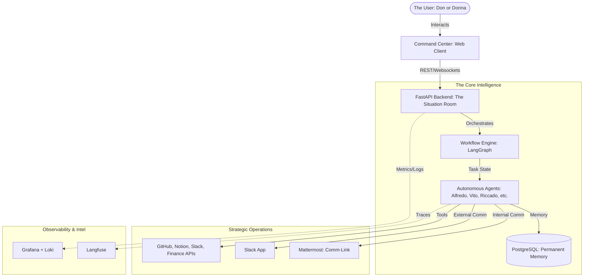

# **“Famiglia Core”** - The Engine of the AI Famiglia


`Famiglia Core` is the foundational multi-agent framework that powers the entire **“La Passione”** ecosystem. It provides the shared intelligence, tooling, and memory management required to build and scale autonomous agents.

---

# Getting Started

```bash
# 1. Pull the official image
docker run -d --name famiglia-core -p 8000:8000 -p 5173:5173 --env-file .env ghcr.io/ai-passione/famiglia-core:production
```

> [!TIP]
> Ensure you have your `.env` file configured with required API keys. See [env.example](env.example) for the list of required secrets.

---

# **Core Features**

## Multi-Agents in one place

- What is better than having an AI assistant? Having a family of AI agents working for you!
- Each agent has its own personality, skills, and tools - Just like a real family.
- See [**Detailed Agent Roster**](docs/agent_roster_la_famiglia.md) for full profiles, skills, and soul definitions.

## Local first, Privacy first
- 0 dependency on any external service by default.
- All data is stored locally in your own infrastructure.
- You own your data, you own your agents, you own your privacy.

## 24/7 Operations
- **Runtime:** Agents run 24/7 and work around the clock for you.
- **Coordination:** Hybrid model - Direct assignment in Command Center (or @mentions in Slack) + Auto-response to triggers.
- **Personality:** Professional during work week, more casual Friday evenings and weekends.
- **Scheduled Tasks:** Commend & Conquer! Assign scheduled tasks and re-occuring tasks to your AI family.  See [**Scheduled Tasks Documentation**](src/famiglia_core/agents/orchestration/README.md) for details on the recurring scheduler and background worker.

## Persistent Memory
- The Famiglia never forgets. All interaction history is securely stored in your local **PostgreSQL** database.
- **Personalization:** Over time, agents learn your preferences—what you like, what you don't, and how you work—adapting their "Soul" to your unique rhythm.
- **Total Sovereignty:** Your memory, your data, your local infrastructure.
- Toggle with `AGENT_CONTEXT_ENABLED=true|false` in `.env`.

## Command Center (Web UI)
- **Primary Interface:** A premium React-based dashboard for real-time monitoring and orchestration.
- **Features:** Agent roster with live status, real-time action feed, and cross-platform task management.
- **Location:** `src/famiglia_core/command_center/frontend` (Web: Port 5173) and `src/famiglia_core/command_center/backend` (API: Port 8000).

---

# **La Tecnologia & Architecture**

## 🏛 The Architecture



Our multi-agent system is built on a high-performance, containerized stack designed for "Sovereign Intelligence" and multi-platform coordination.

### 🧠 Sovereign Intelligence
- **LLM Engine:** [Ollama](https://ollama.com/) (Managing multiple models locally for absolute privacy)
- **Primary Models:**
  - **Reasoning:** [DeepSeek R1 (7B)](https://ollama.com/library/deepseek-r1:7b)
  - **Coding:** [Qwen 2.5 Coder (7B)](https://ollama.com/library/qwen2.5-coder:7b)
  - **Daily Tasks:** [Gemma 3 (4B)](https://ollama.com/library/gemma3:4b)
- **Orchestration:** Python-based autonomous agent framework powered by **LangGraph**, with dual-tier VRAM management and stateful memory.

### 🏛️ Service Architecture
To ensure scalability and clean separation of concerns, the system is split into three main services:

1.  **Command Center Web**: A React/Vite/TypeScript frontend (Port 5173).
    - `src/famiglia_core/command_center/frontend/Dockerfile`: A multi-stage Node/Nginx build.
2.  **Command Center Backend**: The central engine for agent operations, state management, and real-time API services (Port 8000).
    - `src/famiglia_core/command_center/backend/Dockerfile`: A specialized Python environment for the Core Backend and API.
3.  **Famiglia Comm-Link (MatterMost/Slack)**: The core messaging and orchestration bridge.
    - `Dockerfile`: Top-level, runs the Python Slack listener and agent orchestrator.
    - `Dockerfile.mattermost`: A specialized Debian-based Mattermost image for internal coordination (Port 8065).

### 🧱 Core Tech Stack
- **Language:** Python 3.12+ (managed with `uv`) & TypeScript (React)
- **Persistence:** [PostgreSQL](https://www.postgresql.org/) (Conversation history & long-term memory)
- **Caching:** [Redis](https://redis.io/) (Scheduled task queue & temporary state)
- **Containerization:** [Docker](https://www.docker.com/) & [Docker Compose](https://docs.docker.com/compose/)
- **Messaging:** [Mattermost](https://mattermost.com/) (Self-hosted) & [Slack](https://slack.com/) (Socket Mode)

### 🔌 External Integrations
- **Messaging:** [Slack](https://slack.com/) & [Mattermost](https://mattermost.com/)
- **Productivity:** [Notion](https://www.notion.so/) (Teamspace & DB integrations)
- **Development:** [GitHub API](https://docs.github.com/en/rest) (Issue & PR management)

### 🚀 CI/CD & Infrastructure
- **Pipeline:** GitHub Actions (Automated versioning & GHCR builds)
- **Registry:** GitHub Container Registry (`ghcr.io`)
- **Observability:** [Grafana](https://grafana.com/) & [Loki](https://grafana.com/oss/loki/) (Container observability)
- **AI Observability & Tracing:** [Langfuse](https://langfuse.com/) (Full-lifecycle agent observability)

Please refer to the `README.md` files in the respective directories for more details.

---

## Technical Guides
- [**Command Center**](src/famiglia_core/command_center/README.md): Unified dashboard for real-time monitoring and management.
- [**The Agents**](src/famiglia_core/agents/README.md): Detailed logic for the recurring scheduler and background worker.
- [**Contribution & Architecture**](CONTRIBUTING.md): Details on project structure and communication flow.

## Folder Structure & Important Files
```
.
├── src/
│   └── famiglia_core/
│       ├── agents/                # LangGraph workers and orchestration
│       ├── command_center/        # Dashboard (Frontend & Backend)
│       ├── db/                    # PostgreSQL and context storage
│       └── observability/         # Logging and metrics logic
├── tests/                         # Unit and integration tests
├── docs/                          # Detailed architecture and agent rosters
├── Dockerfile                     # Core Famiglia service (Slack/Orchestrator)
├── Dockerfile.mattermost          # Self-hosted Mattermost service
├── docker-compose.yml             # Local development orchestration
├── pyproject.toml                 # uv-based dependency management
└── .env.example                   # Environment variable template
```

## FAQs

### 🧩 Why multiple Dockerfiles & .gitignores?
- **Dockerfiles**: Each service requires a different runtime or entry point. The Frontend needs Node.js for building, while the Backend and Slack app use different Python entry points. This separation allows for independent scaling and smaller, more secure images.
- **.gitignore Files**: The root `.gitignore` handles global exclusions (like `.env`). The `src/command_center/frontend/.gitignore` handles frontend-specific artifacts (like `node_modules` and `dist`) created by Vite. This keeps the configuration close to the code it affects.

---

# 🤝 Contributing

We welcome additions to the Family, provided they follow our [Code of Conduct](CODE_OF_CONDUCT.md). Please see our [CONTRIBUTING.md](CONTRIBUTING.md) for details on how to pitch your visions and submit PRs.

---

# ⚖️ License

Built with ❤️ by **AI Passione.**

This project is licensed under the **Apache License 2.0**. See the [LICENSE](LICENSE) file for the full text.
