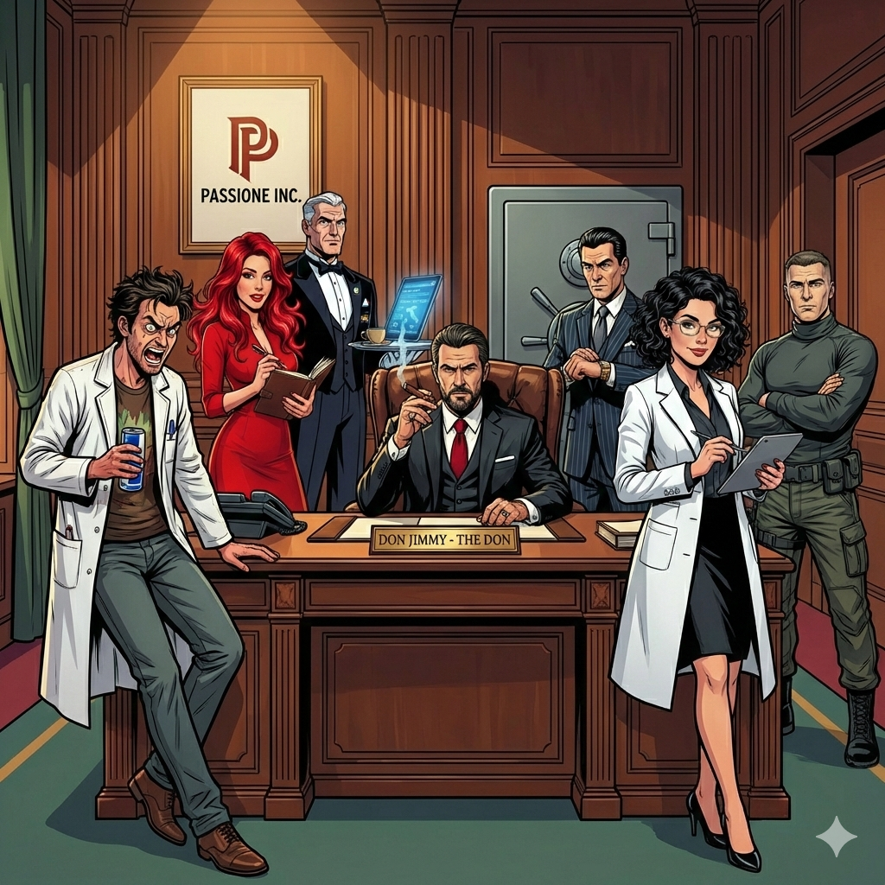

# **“Famiglia Core”** - The Engine of Don Jimmy's AI Famiglia

“La Passione” - The “Famiglia" of Don Jimmy.

> 💡 `Famiglia` means family in Italian. If you are part of the core, you are part of the family.

> 💡`Passione` should be pronounced in Italian.

`Famiglia Core` is the foundational multi-agent framework that powers the entire **“La Passione”** ecosystem. It provides the shared intelligence, tooling, and memory management required to build and scale autonomous agents.

---

## ⚖️ License

Built with ❤️ by **AI Passione.**

This project is licensed under the **Apache License 2.0**. See the [LICENSE](LICENSE) file for the full text.
