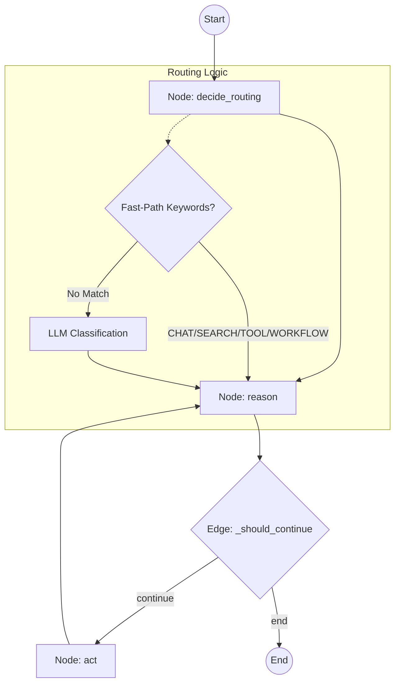

# Agent Routing & Model Selection

This document explains the routing logic and model selection strategy implemented in `src/agents/base_agent.py`. The system is designed to balance intelligence and execution reliability against resource consumption (RAM/Latency).

## Orchestration Architecture (LangGraph)

The agent orchestration is powered by **LangGraph**, transforming the execution loop into a formal state machine (`StateGraph`). This provides robust multi-turn reasoning and reliable tool execution.

### The State Machine

Every user message initializes an `AgentState` object which flows through the following graph nodes:



### Key Components

| Component | Responsibility |
| :--- | :--- |
| **`AgentState`** | A TypedDict capturing the task, history, memories, and current tool triggers. |
| **`decide_routing`** | Determines the intent (CHAT, SEARCH, TOOL, etc.) and chooses the appropriate model. |
| **`reason`** | The core LLM turn. It interprets history + task and either produces a response or a `[TRIGGER:]`. |
| **`act`** | Executes the requested Python tool and appends the result to the conversation history. |
| **`_should_continue`** | Condition logic that keeps the agent in the `reason <-> act` loop until no more tools are needed. |

## Intent Modes & Model Selection

To balance latency and intelligence, the system assigns different model tiers based on the routing mode:

| Mode | Trigger | Model Strategy |
| :--- | :--- | :--- |
| **CHAT** | Greetings, trivial chit-chat | **Lite Model** (e.g., Gemma 3 1B/4B) |
| **SEARCH** | "search for X", "lookup Y" | **Lite Model** for all turns |
| **TOOL** | "list issues", "create page" | **Primary Model** for precise tool arguments |
| **WORKFLOW** | "diagnostic", "check access" | **Primary Model** for system-level precision |
| **COMPLEX** | Analysis, strategy, coding | **Primary Model** (e.g., Gemini 2.0 Flash) |

## Key Implementation Details

### 1. Fast-Path Routing
Inside `AgentOrchestrator._get_routing_mode`, we use hardcoded keyword sets to save on LLM inference:
- **Greetings**: `hi`, `hello`, `ciao`, etc. → `CHAT`
- **Workflow**: `diagnostic`, `system check` → `WORKFLOW`
- **Tool Access**: `list issue`, `github`, `notion` → `TOOL`
- **Planning**: `analyze`, `strategy`, `plan` → `COMPLEX`

### 2. Multi-turn Reliability
For `COMPLEX` tasks, the system maintains the 3B model throughout the entire lifecycle. This prevents "intelligence drop-off" where a smaller model might lose context or regess into Italian during step 2 of a technical task.

### 3. Soul Optimization
- **Full Soul**: Includes "Specialized Skills" and detailed tool instructions. Used for Turn 1 of COMPLEX tasks.
- **Lite Soul**: Minimal personality sections. Used for Turn 2+ of simple tasks or pure chat to keep context windows small.

### 4. Anti-Hallucination
The `COMPLEX` and `SEARCH` prompts include strict rules:
- **Trigger First**: Never summarize success until a `[TOOL_RESULT]` is received.
- **Strict English**: Professional technical communication must be in English, bypassing atmospheric persona phrases if they interfere with task clarity.

## Project Structure (`src/agents/`)

- **`llm/`**: The LLM integration layer, managing connections to local/remote Ollama instances and resource allocation.
- **`souls/`**: Contains the "personality" and prompt definitions for each agent.
- **`tasks/`**: Backend workers for scheduled and recurring tasks.
- **`utils/`**: Shared skills and workflow mixins that empower agents.
- **`base_agent.py`**: The core foundation class for all agents.
- **`alfredo.py`, `riccardo.py`, etc.**: Individual agent class definitions.

## Tools, Skills & Workflows (`src/agents/`)

The agent architecture uses a tiered abstraction model to provide agents with capabilities while maintaining clean, reusable code.

### 1. Tools (`src/agents/tools/`)
Tools are the lowest layer, containing the raw implementation of external integrations and API clients:
- **`github.py`**: Low-level GitHub API client logic.
- **`notion.py`**: Integration with Notion's API.
- **`web_search.py`**: Logic for performing web searches.

### 2. Skills (`src/agents/utils/skills.py`)
Skills are agent-facing Mixins that wrap low-level tools into convenient "powers" for inheritance:
- **`CommonSkills`**: Standard capabilities shared by all agents.
- **`GitHubSkills`**: Higher-level repository and issue management.
- **`NotionSkills`**: Structured interaction with Notion workspaces.

### 3. Workflows (`src/agents/utils/workflow.py`)
Workflows represent complex, multi-step procedures which orchestrate multiple Skills and Tools locally or via LLM turns (e.g., `test_github_diagnostic`).

### Usage Example
Agents inherit from `BaseAgent` and the desired skill/workflow mixins:

```python
from src.agents.base_agent import BaseAgent
from src.agents.utils.skills import CommonSkills, GitHubSkills
from src.agents.utils.workflow import Workflows

class TechnicalAgent(BaseAgent, CommonSkills, GitHubSkills, Workflows):
    def __init__(self):
        super().__init__(agent_id="tech_bot", name="Tech Bot", ...)
        # Register the inherited capabilities as agent tools
        self.register_tool("web_search", self.web_search)
        self.register_tool("test_github_diagnostic", self.test_github_diagnostic)
```
