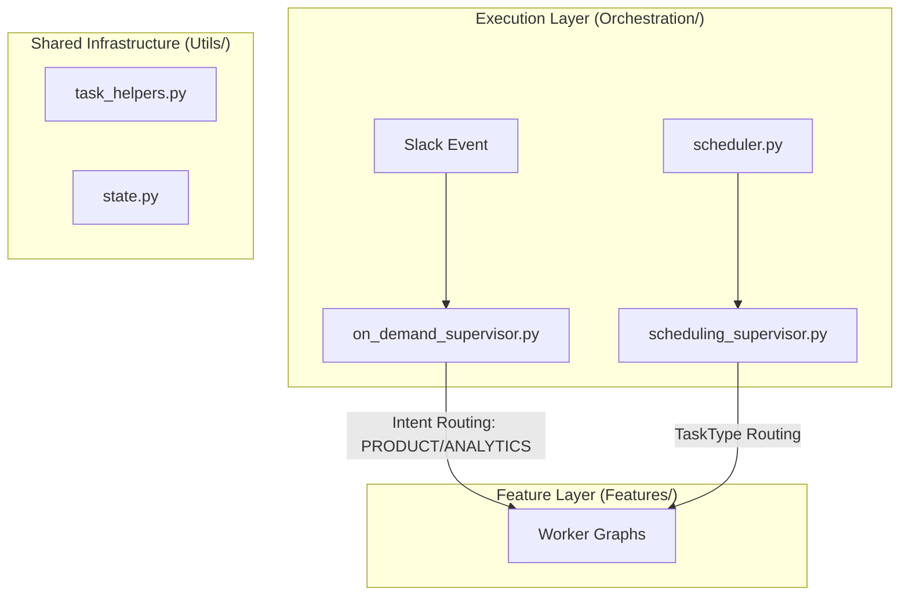
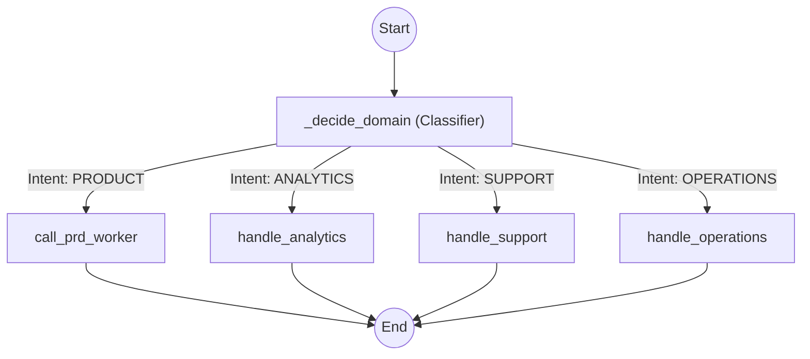
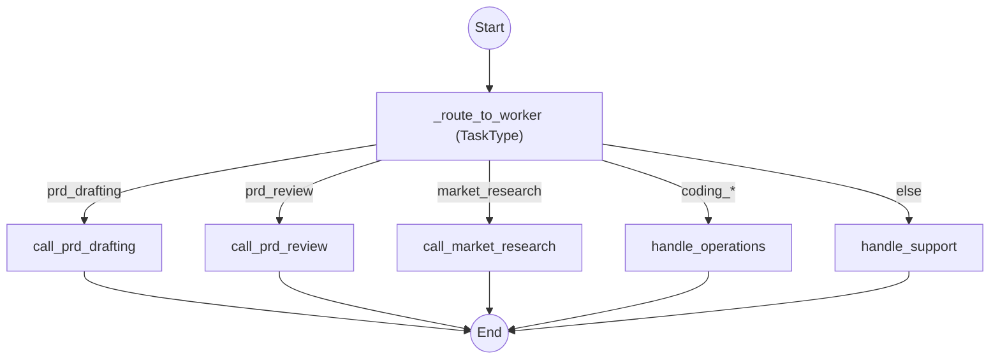

# Orchestration Layer

The orchestration layer is responsible for routing tasks to the appropriate feature workers. It strictly separates interactive requests from autonomous background tasks.

## Components

### 1. Master Supervisors
- **On-Demand (`on_demand_supervisor.py`)**: Handles interactive Slack requests for Product, Operations, and Analytics.
- **Scheduling (`scheduling_supervisor.py`)**: Handles autonomous background logic.

### 2. Execution Engine
- **Scheduler (`scheduler.py`)**: The background poller that checks the database and triggers the Scheduling Master Supervisor.

### 3. Utils (`utils/`)
- **`task_helpers.py`**: Consolidated data models (`Task`), configuration constants, and agent tools (`TaskTools`).
- **`state.py`**: Shared `AgentState` definitions for LangGraph.
- **`tasks.yml`**: Definition of recurring task schedules and agent assignments.

### 4. Quality Assurance
- **Tests**: Core orchestration logic is validated in `tests/agents/test_orchestration.py`, `tests/agents/test_scheduling_supervisor.py`, and `tests/agents/test_state.py`.

## Architecture

### On-Demand Supervisor Flow

### Scheduling Supervisor Flow

## Directory Structure
- `features/`: Individual LangGraph workflows for specific capabilities.
- `utils/`: Supporting data models, shared state, and task configuration.
- `on_demand_supervisor.py`: Entry point for interactive user messages.
- `scheduling_supervisor.py`: Entry point for autonomous tasks.
- `scheduler.py`: Background task engine.
