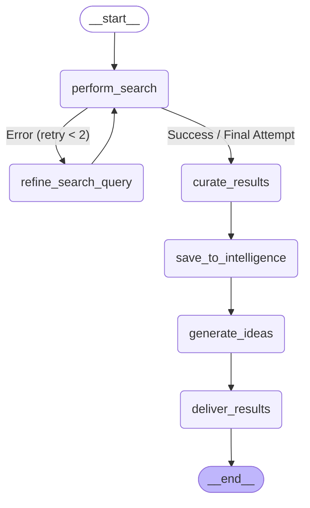
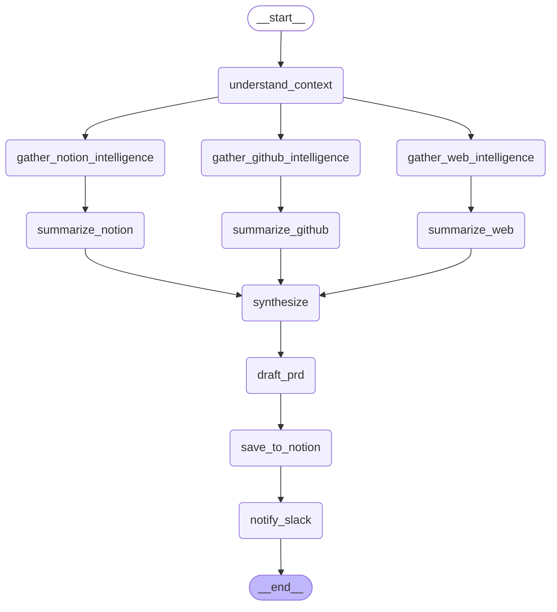
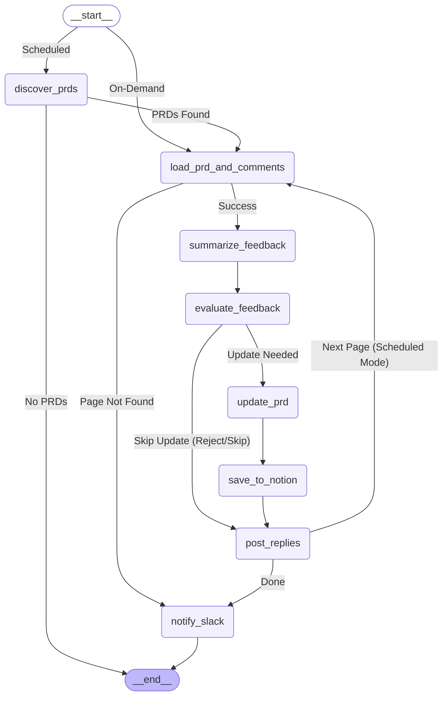
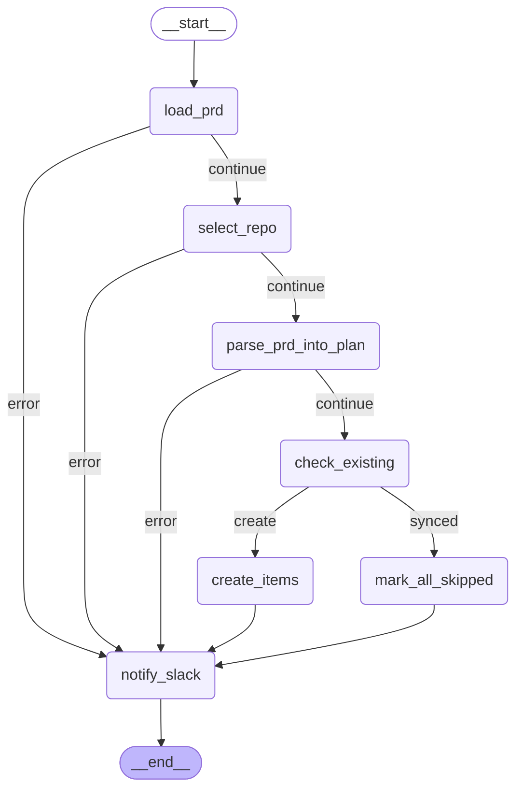
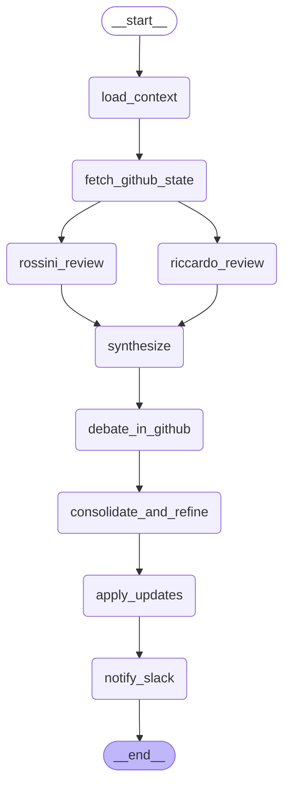
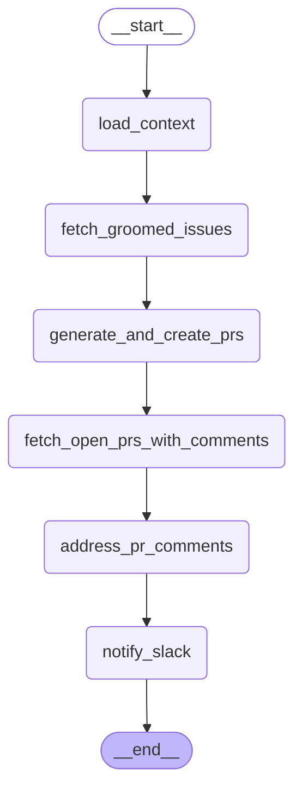
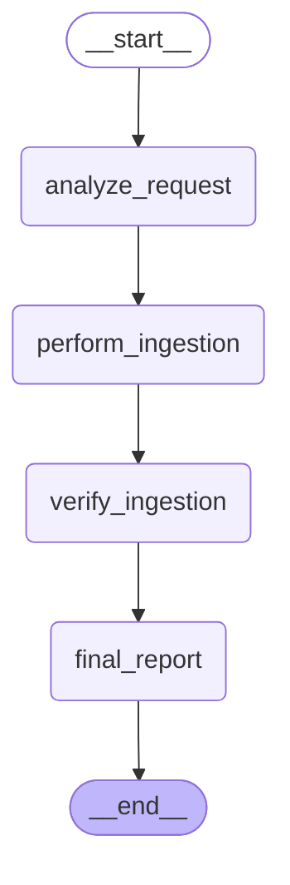
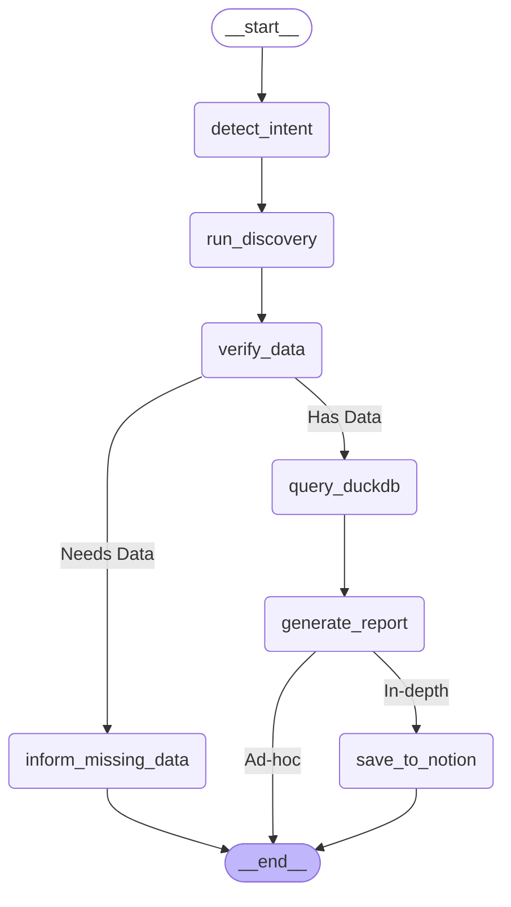
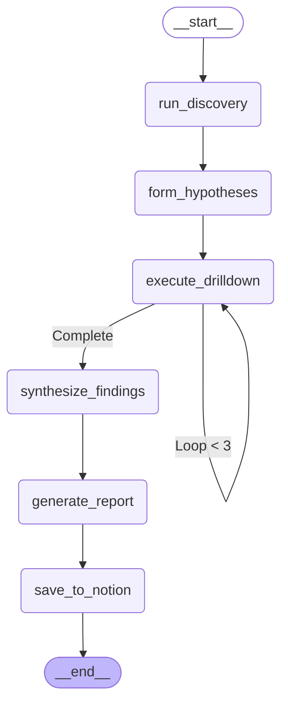

# Agent Feature Modules

This directory contains specialized LangGraph-driven features organized by domain. These workflows are orchestrated by supervisors and executed by **Dr. Rossini**, **Riccardo**, and **Kowalski**.

## Table of Contents
1. [Model Selection & Resolution](#model-selection--resolution)
2. [Market Research Features (Rossini)](#market-research-features-rossini)
3. [Product Development Features (Rossini & Riccardo)](#product-development-features-rossini--riccardo)
4. [Analytics Features (Kowalski)](#analytics-features-kowalski)
5. [Universal Notion & Slack Formatting Standards](#universal-notion--slack-formatting-standards)

---

## Model Selection & Resolution

The orchestration layer enforces a **Proactive Model Resolution** strategy. Before a feature workflow begins, the Supervisor resolves the best available LLM based on system tiering and injects it into the agent state (`state["model_to_use"]`). This ensures all sub-nodes in a complex graph utilize a consistent, high-performance model.

### Availability Tiers
1.  **Tier 1 (Cloud - Gemini 2.0 Flash)**: Primary choice for complex reasoning and clinical analysis. Used when `GEMINI_API_KEY` is present.
2.  **Tier 2 (Local - Mistral 7B)**: Fallback for local-first environments or when cloud tokens are unavailable. Verified via Ollama service status.
3.  **Tier 3 (Local/Remote - Gemma 3)**: Global system fallback for basic orchestration and simple tasks.

---

## Market Research Features (Rossini)

Located in `market_research/`, focused on external intelligence and strategic ideation.

### 1. Market Research Workflow
Performs iterative web searches, curates insights into the **Intelligence Center**, generates innovative business proposals, and delivers results to the **Directive Terminal** (with an optional Slack notification to #Research-Insights).
- **File:** `market_research/market_research.py`
- **Tests:** `tests/agents/test_orchestration_features.py` (100% Logic Coverage)
- **Workflow Architecture:**

---

## Product Development Features (Rossini & Riccardo)

Located in `product_development/`, these features cover the full lifecycle from PRD to Pull Request.

### 1. PRD Drafting
Automates the creation of Product Requirement Documents by synthesizing Notion intelligence, GitHub repositories, and Web trends.
- **File:** `product_development/prd_drafting.py`
- **Workflow Architecture:**

### 2. PRD Review & Iteration
Analyzes Notion comments and calibrates PRD updates using "System 2" thinking.
- **File:** `product_development/prd_review.py`
- **Workflow Architecture:**

### 3. Milestone Creation
Synchronizes approved PRDs with GitHub by semantic deduplication of issues and milestones.
- **File:** `product_development/milestone_creation.py`
- **Workflow Architecture:**

### 4. Grooming (Rossini ↔ Riccardo)
Facilitates collaborative grooming where Rossini sets priorities and Riccardo provides technical effort estimations (XS-XL).
- **File:** `product_development/grooming.py`
- **Workflow Architecture:**

### 5. Code Implementation & PR Review
Leverages coder models (e.g., Qwen 2.5 Coder) to implement groomed issues and address human feedback on open Pull Requests.
- **File:** `product_development/code_implementation.py`
- **Workflow Architecture:**

---

## Analytics Features (Kowalski)

Located in `analytics/`, these features focus on clinical data ingestion and Evidence-Driven Analysis.

### 1. Ad-hoc Data Ingestion & Inspection
Enables ingestion of CSV, Parquet, or JSON files provided via Slack into the persistent **DuckDB Data Warehouse**.
- **File:** `analytics/data_ingestion.py`
- **Workflow Architecture:**

### 2. Simple Data Analysis
Provides rapid ad-hoc insights and numerical snapshots with SCD (Slow-Changing Dimension) awareness.
- **File:** `analytics/simple_data_analysis.py`
- **Workflow Architecture:**

### 3. Deep Dive Analysis
An iterative, hypothesis-driven analytical workflow for complex investigations.
- **File:** `analytics/deep_dive_analysis.py`
- **Workflow Architecture:**

---

## Universal Notion & Slack Formatting Standards

To ensure a premium and consistent experience across the Famiglia's communication channels, all agents follow these standards:

### Slack Formatting
- **Bold Headers**: Use `*Header Name*` on its own line.
- **Bullets**: Use the `• ` (bullet point symbol) for list items. This provides the best cross-platform indentation.
- **Zero-Preamble Reporting**: Reports must start directly with the header, ignoring any greetings or conversational noise.
- **Code Highlights**: Use backticks (`) for column names, table names, and specific data values.

### Notion Rendering
- **Advanced Markdown Support**: Custom parser correctly renders bolding, lists, inline code, tables, and blocks with syntax highlighting.
- **Adaptive Annotations**: Automatically translates Markdown into native Notion rich-text annotations.
